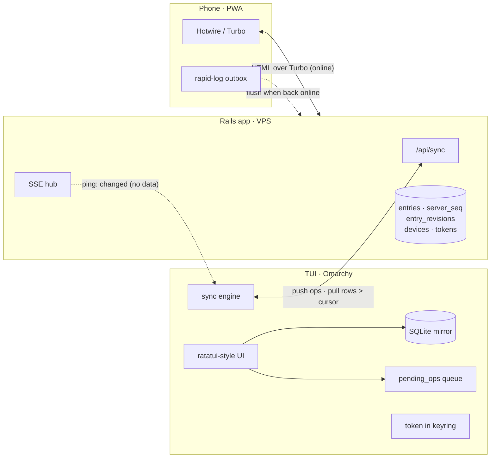
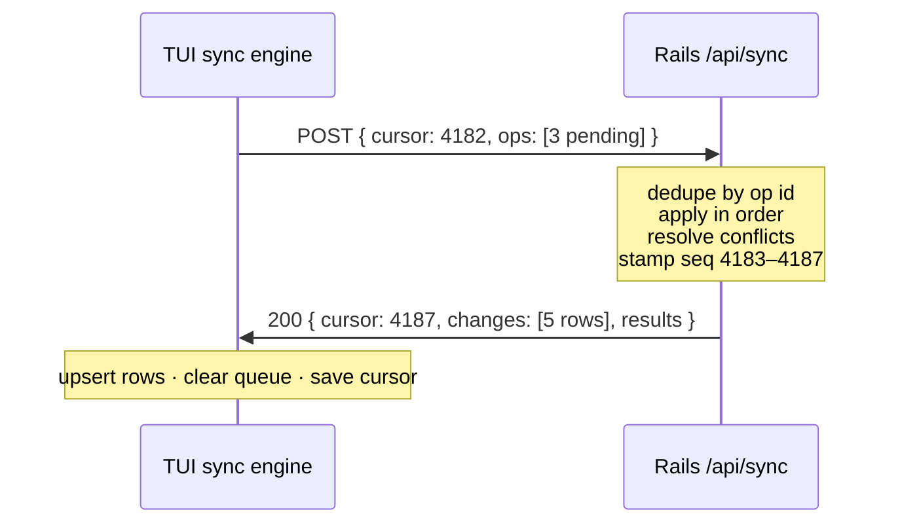
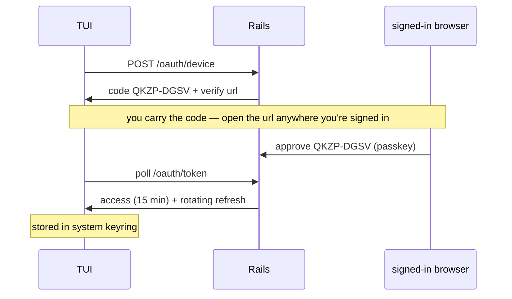

# Bujo Sync

How one journal stays whole across a terminal on the desk and a phone in your pocket.

Styled version with figures: https://claude.ai/code/artifact/062d1db5-9c9e-4748-9ae7-e2593626c623

Status: **proposal, draft for discussion** · Aug 23, 2026 · page model
revised Aug 24 · source-alignment corrections Aug 25 and Aug 28
(operator-approved for slice 1.5.1)

## What we're designing for

The daily reality is simple: rapid-log at the desk in the TUI, walk away, pull out the phone at the store, and the journal is just *there* — then come home and the TUI already knows what happened. Two clients, one journal, no ceremony.

The workload makes this very tractable: single user, a handful of devices, small append-mostly rows, and true conflicts (the same entry edited on both devices while one is offline) will be rare. We don't need distributed-systems heroics — we need a boring, correct design whose failure modes are all thought through.

**Principles**

1. **One source of truth.** The Rails app is the authority. Clients converge to it; they never negotiate with each other.
2. **Capture never waits on the network.** Rapid logging is the sacred act. It writes locally in milliseconds, online or not.
3. **One data path.** All journal data moves through a single sync endpoint. Real-time pings are wake-ups, never data.
4. **Never silently lose words.** A journal runs on trust. Conflict losers are kept as revisions; edits resurrect deletes.
5. **Boring beats clever.** Plain Rails, SQLite, HTTPS, and a cursor. Every piece is inspectable with curl and sqlite3.

## Decisions at a glance

| Decision | Choice | Why |
|---|---|---|
| Source of truth | Rails server (VPS, Kamal-deployed) | One authority; clients are replicas that converge |
| Server stack | Rails 8 · SQLite + Litestream · Solid Queue/Cable | Single-user scale; cheap, durable, all-Ruby |
| TUI storage | Local SQLite mirror + `pending_ops` queue | Instant reads/writes; full offline |
| Sync shape | Push operations up, pull row snapshots down by cursor | Ops preserve intent; snapshots keep clients simple |
| Ordering | Global `server_seq` + hybrid logical clock per edit | Server orders history; HLC orders concurrent edits |
| Conflicts | Field-level LWW + journal rules; losers kept | Rare conflicts, zero silent data loss |
| Real-time | SSE "changed" ping that triggers a normal sync | Sub-second freshness without a second data path |
| TUI auth | OAuth device grant → rotating refresh token in keyring | Built for keyboard-only clients; revocable per device |
| Web auth | Rails 8 sessions + passkeys | Phishing-resistant, great on a phone |
| Phone offline | Online-first PWA + rapid-log outbox | Capture is the only thing that must work offline |

## Topology

Hub and spoke. The Rails app serves the phone as a normal Hotwire application — server-rendered HTML, no client database, no sync problem at all on that side. The TUI is the interesting client: a small Ruby program whose UI reads and writes only its local SQLite mirror, with a sync engine reconciling against the server in the background. The TUI never blocks on the network for anything the user does.



All journal data crosses the `/api/sync` edge. Dashed edges are wake-ups and deferred capture; they carry no journal state.

## A data model that makes sync easy

Most sync pain is self-inflicted at the schema level, so the schema does three deliberate things:

- **Client-generated UUIDv7 ids.** The TUI can create entries offline with no id-collision risk and no "temporary id" bookkeeping — the id it mints is the id forever. UUIDv7 is time-ordered, so ids sort naturally and index well.
- **Pages are columns, not containers — and placement is immutable through the domain.** Every entry is born onto exactly one page — a Daily Log, a month's Calendar or Tasks page, the Future Log, or a Custom Collection — recorded by plain placement columns (`page_kind`, `page_on`, and `collection_id` when applicable) set at creation and never changed by a public model/domain API. Logs remain scopes over those columns (no container tables, nothing to join), but they are *residency* queries now, not date derivations: a page shows only what a hand placed there. A transient reflection, Index, or search lens may reference the original row without conferring a second residency. The original design derived logs from dates to kill the "moved between containers on two devices" conflict class; immutable domain placement kills it just as dead, because moving is never an update —
- **Migration is append, not mutation.** Moving an entry writes a *new* entry on a structurally valid destination page and marks or links the old one through `migrated_from_id`, exactly how the paper method rewrites by hand. Tasks mark the predecessor with `state: migrated`; events and notes keep their NULL state, and their moved-ness derives from the successor's existence. The glyph direction reads off the successor's page: `<` when it moved backward into the Future Log, `>` when it moved forward into a month or collection. Append-only chains merge trivially, and the "carried 2×" honesty in the UI falls straight out of the chain length.

```text
# the tables that matter (server; the TUI mirrors entries + collections)
entries         id uuidv7 · kind task|event|note · text · state open|done|struck|migrated
                page_kind daily|monthly_calendar|monthly_tasks|future|collection (immutable)
                page_on? (daily: the day · monthly pages: first of month · else NULL, immutable)
                occurs_on? (the date the entry is ABOUT: calendar slot, future-log date)
                time_of_day · priority · tags · collection_id? (page_kind=collection only)
                parent_id? · migrated_from_id? (unique) · hlc · server_seq · deleted_at?
entry_revisions entry_id · field · lost_value · lost_hlc · kept_hlc   # conflict losers
collections     id uuidv7 · user_id · name · index_position? · hlc · server_seq
                · deleted_at? · timestamps  # custom only; core pages are column values
devices         id · name · kind tui|web · refresh_token_digest
                last_synced_seq · last_seen_at · revoked_at?
applied_ops     op_id (unique) · device_id · applied_at               # idempotency ledger
```

The page vocabulary is structural. Root entries on Daily Logs and
Custom Collections may be tasks, events, or notes; Monthly Calendar
roots are tasks or events; Monthly Tasks roots are tasks; Future Log
roots are dated tasks or events. A nested child may supply any bullet
kind as context, but must share its root's page. These rules keep the
core Collections semantically distinct without multiplying tables.

Time-dependent admission belongs at the capture/movement boundary,
which receives a caller-supplied `as_of` date; it is not a timeless row
validation and does not put a wall clock inside `Entry`. This is
distinct from the parser's page-relative `today` context. New Future Log
roots must fall after the current month. Daily capture accepts today or
past pages. Direct Monthly capture accepts current or past months;
future Monthly pages may contain deliberately migrated residents but
are not ordinary writing surfaces. Existing Future Log residents remain
valid and visible when time makes them current or overdue. Database
constraints enforce expressible structure (including one successor per
predecessor); direct SQL is not claimed to preserve the domain-only
placement immutability rule.

The deliberate Index is a query over kept Custom Collections, not a synced
container or membership table. Every kept Custom Collection has a non-NULL
server-owned `index_position`; the nullable column remains only so tombstones
and compatible snapshots can preserve prior state. Collection snapshots carry
that field. Clients push Collection creation intent with an id and Topic, not
a rank: the Rails authority allocates the next retained position while
creating the Collection atomically. Rename and soft deletion preserve that
position. There are no register, unregister, client-authored reorder, or
hidden-live-Collection operations. HLC will resolve competing editable
Collection fields, and `server_seq` will order resulting snapshots once sync
is active; neither is activated by the Index correction. The TUI continues to
mirror `collections` rows, and the Index introduces no third entity, cursor,
HLC, or server sequence.

## The sync protocol

One endpoint, one round trip, resumable from any point. Every server-side write — from any client — bumps a single global counter and stamps it on the changed row as `server_seq`. A client holds one integer cursor: the highest `server_seq` it has seen. Syncing is:

1. **Push:** send every queued local operation (each op has its own UUID).
2. **Apply:** the server dedupes ops it has already seen, applies the rest in order, resolves any conflicts, and stamps fresh `server_seq` values.
3. **Pull:** the server returns full snapshots of every row with `server_seq` greater than the cursor — which includes the just-applied results and anything the phone did meanwhile — plus the new cursor.

Pushing *operations* (not row states) preserves intent — "mark done" and "edit text" to the same entry from two devices both survive, because they touch different fields. Pulling *snapshots* (not op replays) keeps the client trivial: upsert rows, done. Deletes ride along as soft-deleted rows, so they replicate like any other change.



One round trip both delivers local edits and catches up on everything other devices did. A fresh device is just cursor 0. Retry-safe: the same request replayed gives the same result, no double-apply.

The wire format, concretely:

```jsonc
// request
POST /api/sync
{ "cursor": 4182, "epoch": "9d31c0",
  "ops": [
    { "id": "0198f4a1-…", "entity": "entry", "entity_id": "0198f3b9-…",
      "action": "update", "fields": { "state": "done" },
      "hlc": "2026-08-23T18:04:12.331Z-0002-tui.a1b2" } ] }

// response
{ "cursor": 4187, "epoch": "9d31c0",
  "changes": [ { "entity": "entry", "id": "0198f3b9-…", "state": "done" } ],
  "results": [ { "id": "0198f4a1-…", "status": "applied" } ] }
```

Two details carry a lot of weight. The **op id** makes every push idempotent: a timeout mid-request is answered by simply retrying, and the `applied_ops` ledger guarantees nothing applies twice. The **epoch** is a random value minted with the database; if the server is ever restored from backup, the epoch won't match, and clients respond by re-pulling from cursor 0 and re-pushing anything still queued — recovery is automatic, not a support incident.

### Ordering without trusting clocks

Wall clocks on laptops drift, and a plain `updated_at` comparison can make an older edit beat a newer one. Each edit instead carries a **hybrid logical clock**: the device's wall time, but never allowed to move backwards, with a counter to break ties and the device id as the final tiebreak. It costs one string per op and removes the entire clock-skew failure class. The server's `server_seq` orders *history*; the HLC orders *concurrent edits* when two devices touched the same field while apart.

### When both sides edited

Conflicts resolve per field, under rules that favor the journal's integrity over symmetry:

| Situation | Resolution |
|---|---|
| Same field, both edited | Later HLC wins; the losing value is written to `entry_revisions`, surfaced in the entry's history — never silently gone |
| Different fields edited | Both apply; no conflict at all (the common case) |
| `open` vs `done` | Done wins regardless of clock order — a completion is never resurrected into a todo |
| Edit vs delete/strike | The edit wins and revives the entry — words beat tombstones |
| Edit vs migrate | The edit lands on the live end of the migration chain |
| Migrate vs migrate (same entry, both devices) | The unique index on `migrated_from_id` admits one successor; the second op is refused, and that device's next pull shows the winning chain — placement never merges because it never mutates |

## Real-time, without a second data path

Cursor sync alone would mean the TUI is at most one poll interval stale. To make cross-device edits feel instant, the server exposes a Server-Sent Events stream that emits exactly one kind of message: *"something changed, seq N."* The TUI holds that connection open when online and responds to a ping by running a normal sync. SSE over plain HTTP suits a terminal client perfectly — trivially debuggable with curl, auto-reconnecting, no websocket machinery. If the stream drops, the TUI degrades to syncing on launch, after each local write, and every 30 seconds. Pings carry no journal data, so there is exactly one code path that moves state, and it is the one that is idempotent and resumable.

## Security

The journal is intimate data; the security model treats it that way.

### Web: sessions and passkeys

The phone PWA uses ordinary Rails 8 session auth with **passkeys** as the sign-in method — phishing-resistant and one Face-ID tap on a phone. Standard hardening applies: TLS everywhere with HSTS, secure/httpOnly session cookies, CSRF protection on the Hotwire side.

### TUI: the device grant

The TUI never sees a password. `bujo login` runs the OAuth 2.0 **device authorization grant** (RFC 8628) — the flow purpose-built for keyboard-and-text clients:



No password ever touches the terminal. The human carrying the short code between devices is the authentication.

Token lifecycle rules:

- **Access tokens are short-lived** (~15 minutes) and sent as a bearer header; the refresh token mints new ones.
- **Refresh tokens rotate on every use**, stored server-side only as a digest, bound to one row in `devices`. If a stolen refresh token is replayed after rotation, the reuse is detected and the whole device's token family is revoked — theft self-destructs.
- **Storage on Omarchy** goes through the system keyring (libsecret / `secret-tool`), falling back to a `0600` file under `$XDG_DATA_HOME/bujo` if no keyring daemon is running.
- **Revocation is a page, not a procedure.** The web app's settings list every device — name, kind, last sync — with a revoke button. Server-side scoping comes only from the token; a request can never name another user's data.

**Considered and deferred: end-to-end encryption.** Client-side encryption of entry text would make the server blind to your journal, at the cost of server-side search, the plain Hotwire web client, and painless key recovery. For a self-hosted single-user system, disk encryption at rest plus the model above is a sane v1; the op-based protocol doesn't preclude adding an encrypted-blob entry kind later.

## Failure modes, walked through

| What happens | How the design absorbs it |
|---|---|
| Laptop offline for a week | Everything queues in `pending_ops`; next sync replays in order and the cursor catches up in one round trip |
| Request times out mid-push | Retry the identical request; op ids make replays harmless |
| Laptop clock is wrong | HLC never regresses and the counter breaks ties; wall clocks are advisory |
| Same entry edited on both, offline | Field-level merge + journal rules; any losing value lands in `entry_revisions` |
| New machine / wiped TUI | `bujo login`, cursor 0, full pull; the mirror is disposable by design |
| Server restored from backup | Epoch mismatch → clients re-pull from 0 and re-push queued ops automatically |
| Refresh token stolen | Rotation reuse-detection revokes the device family; manual revoke from the web as backstop |
| Two sync runs race on one device | The sync engine holds a local mutex; one flight at a time per device |

## Roads not taken

**CRDTs (Automerge, Yjs).** They solve concurrent multi-writer merging with mathematical guarantees — and bring a large dependency, per-document metadata growth, and a second source of truth. For single-user structured rows where conflicts are rare and small, field LWW with kept revisions gets the same practical outcome for a fraction of the complexity. If collaborative text ever matters, one field can become a CRDT blob without changing the protocol.

**Local-first sync platforms (ElectricSQL, PowerSync, Turso embedded replicas).** Genuinely good technology, but each adds a non-Ruby moving part between Rails and the clients, and replicating at the *storage* layer bypasses the domain layer — auth scoping, revision capture, migration semantics would need re-implementing at the edge. The policy belongs in the Rails app.

**Raw database replication (LiteFS et al.).** Same objection, sharper: clients would receive rows they should interpret, not rows they were told about. Replication is not an API.

**Polling only.** Honestly viable — and it remains the degraded mode whenever the SSE stream is down. The stream is a latency upgrade, not a dependency.

## Build order

1. **Rails core, no sync.** Models, rapid-log parsing, the Hotwire views from the mocks. The web app alone is already a usable journal.
2. **The sync endpoint.** `server_seq`, `/api/sync`, the ops ledger, HLC handling — testable end-to-end with curl before any TUI exists.
3. **Device grant + a read-only TUI.** `bujo login`, pull-only mirror. Low-risk way to prove the whole pipe.
4. **Local writes + the queue.** The TUI becomes a full client; conflict rules get their tests here.
5. **SSE nudge + phone outbox.** The polish pass: sub-second freshness, offline rapid-log on the phone.

Each step ships something usable on its own, and the riskiest ideas (the protocol, the merge rules) get exercised before the TUI grows an interface around them.

---

**Open for discussion:** whether SQLite-on-the-server feels right versus Postgres, whether deferred E2EE is acceptable for data this personal, and whether the phone needs a fuller offline story than the rapid-log outbox.
